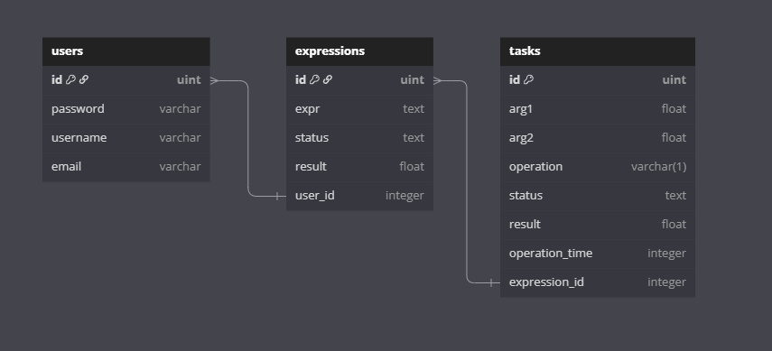

# final_project_go_yandex

> Выражения со скобками не поддерживаются, проше меня понять и написать ишью

## Благадорю


Благадорю всех кто ждал. Вы мои кумиры и я бы вас расцеловал, но так не положено. Мой тг: [@MamaKupiSnikes](https://t.me//MamaKupiSnikers)

## Описание

Система распределённого вычисления арифметических выражений состоит из двух сервисов:

* **Оркестратор**: принимает выражение через HTTP (порт 80), разбивает его на независимые задачи и отдаёт агентам (порт 8081). Хранит данные в PostgreSQL.
* **Агент**: подключается к оркестратору (AGENT\_URL из `.env`), запрашивает задачи, выполняет их и возвращает результаты.

## Требования

* Go 1.20+
* PostgreSQL
* .env-файл с переменными (заполняем сами🙏):

  ```dotenv
  # Orchestrator
  TIME_ADDITION_MS=3000
  TIME_SUBTRACTION_MS=3000
  TIME_MULTIPLICATIONS_MS=5000
  TIME_DIVISIONS_MS=5000
  ORCHESTRATOR_ADDR=localhost:80

  # Agent
  COMPUTING_POWER=4
  AGENT_URL=localhost:8081

  # Postgres
  POSTGRES_DB=postgres_db
  POSTGRES_USER=postgres_user
  POSTGRES_PASSWORD=5050
  POSTGRES_HOST=localhost
  POSTGRES_PORT=5432

  # JWT
  JWT_TOKEN=your_super_secret_token
  ```

## Запуск

1. Клонировать репозиторий:

   ```bash
   git clone https://github.com/nais2008/final_project_go_yandex.git
   cd final_project_go_yandex

2. Запустить оркестратор:

   ```bash
   go run ./cmd/orchestrator/main.go
   ```

   * HTTP ORCHESTRATOR: `http://localhost` (порт 80)
   * HTTP AGENT: `http://localhost:8081`
3. В другом терминале запустить агента:

   ```bash
   go run ./cmd/agent/main.go
   ```

## Примеры запросов

> В авторизации в поле login можно ввести username или email

* Регистрация:

  ```bash
    curl -X POST http://localhost:8080/api/v1/register \
    -H "Content-Type: application/json" \
    -d '{
        "username": "testuser",
        "email": "test@example.com",
        "password": "password123"
    }'
  ```

* Авторизация:

  ```bash
  curl -X POST http://localhost:8080/api/v1/login \
  -H "Content-Type: application/json" \
  -d '{
      "login": "testuser",
      "password": "password123"
  }'
  ```

* Отправка выражения:

  ```bash
  curl --location --request POST "http://localhost/api/v1/calculate" \
    --header "Content-Type: application/json" \
    --header "Authorization: Bearer <TOKEN>" \
    --data '{"expression": "10 + 5"}'
  ```

* Получение списка выражений:

  ```bash
  curl "http://localhost/api/v1/expressions" \
       -H "Authorization: Bearer <TOKEN>"
  ```

* Получение выражения по ID:

  ```bash
  curl "http://localhost/api/v1/expressions/1" \
       -H "Authorization: Bearer <TOKEN>"
  ```

## Запуск тестов

```bash
go test -v ./...
```

## Фронтенд

> [!WARNING]
> В данный момент не работает, простите :(

В `templates/base.html` реализована SPA-страница с использованием HTMX и Tailwind.

> можно посмотреть при переходе на [http://localhost/](http://localhost)

## БД


